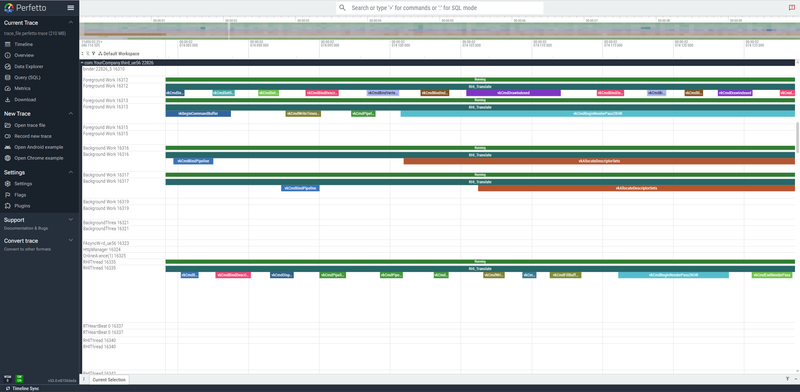

# A Custom Vulkan Layer  

## Introdution

This is a custom Vulkan layer for testing, Which is implemented to hook vulkan api and do nothing else.

This work is modified from [VulkanTools](https://github.com/LunarG/VulkanTools) based on vulkan 1.4.350

## About This Branch
This branch is used to Capture the Vulkan API trace eventin perfetto/systrace tool for android. 




## Build For Android
CMake >= 3.22.1
NDK r25+
Ninja 1.10+

### Android Build Requirements

- Download [Android Studio](https://developer.android.com/studio)
- Install (https://developer.android.com/studio/install)
- From the `Welcome to Android Studio` splash screen, add the following components using the SDK Manager:
  - SDK Platforms > Android 8.0 and newer (API Level 26 or higher)
  - SDK Tools > Android SDK Build-Tools
  - SDK Tools > Android SDK Platform-Tools
  - SDK Tools > Android SDK Tools
  - SDK Tools > NDK
  - SDK Tools > CMake

#### Add Android specifics to environment

NOTE: The following commands are streamlined for Linux but easily transferable to other platforms.
The main intent is setting 1 environment variable and ensuring the NDK and build tools are in the `PATH`.

```sh
# Set environment variable
# https://github.com/actions/runner-images/blob/main/images/linux/Ubuntu2204-Readme.md#environment-variables-2
export ANDROID_NDK_HOME=$ANDROID_SDK_ROOT/ndk/X.Y.Z

# (Optional if you have new enough version of CMake + Ninja)
export PATH=$ANDROID_SDK_ROOT/cmake/3.22.1/bin:$PATH

# Verify CMake/Ninja are in the path
which cmake
which ninja
```

### Android Build

1. Building libraries to package with your APK

Invoking CMake directly to build the binary is relatively simple.

See https://developer.android.com/ndk/guides/cmake#command-line for CMake NDK documentation.

```sh
# Build release binary for arm64-v8a
cmake -S . -B build \
  -D CMAKE_TOOLCHAIN_FILE=$ANDROID_NDK_HOME/build/cmake/android.toolchain.cmake \
  -D ANDROID_PLATFORM=29 \
  -D CMAKE_ANDROID_ARCH_ABI=arm64-v8a \
  -D CMAKE_ANDROID_STL_TYPE=c++_static \
  -D ANDROID_USE_LEGACY_TOOLCHAIN_FILE=NO \
  -D CMAKE_BUILD_TYPE=Release \
  -D UPDATE_DEPS=ON \
  -G Ninja

cmake --build build

cmake --install build --prefix build/install
```

Then you just package the library into your APK under the appropriate lib directory based on the ABI:
https://en.wikipedia.org/wiki/Apk_(file_format)#Package_contents

Alternatively users can also use `scripts/android.py` to build the binaries.

Note: `scripts/android.py` will place the binaries in the `build-android/libs` directory.

```sh
# Build release binary for arm64-v8a
python3 scripts/android.py --config Release --app-abi arm64-v8a
```

`android.py` can also streamline building for multiple ABIs:

```sh
# Build release binaries for all ABIs
python3 scripts/android.py --config Release --app-abi 'armeabi-v7a arm64-v8a x86 x86_64'
```

Now you can upload the layer on to your Android device.

See Android developer documentation for more information on loading Vulkan layers:
https://developer.android.com/ndk/guides/graphics/validation-layer#load-layers

## Enable Layer On Android

Enable layer for single application

````
adb push build/layersvt/libVkLayer_custom.so /data/user/0/com.YourCompany.third_ue56/

adb shell settings put global enable_gpu_debug_layers 1
adb shell settings put global gpu_debug_app com.YourCompany.third_ue56
adb shell settings put global gpu_debug_layers VK_LAYER_CUSTOM

adb shell settings list global | grep gpu
````

Disable
````
adb shell settings delete global enable_gpu_debug_layers
adb shell settings delete global gpu_debug_app
adb shell settings delete global gpu_debug_layers
adb shell settings delete global gpu_debug_layer_app
````

----


Enable glocal layer 
````
adb shell "setpro debug.vulkan.layers VK_LAYER_CUSTOM"
````
Disable
````
adb shell "setpro debug.vulkan.layers ''"
````


## License
This work is released as open source under a [Apache-style license](LICENSE.txt) from Khronos including a Khronos copyright.

## Acknowledgements
While this project has been developed primarily by LunarG, Inc., there are many other companies and individuals making this possible: Valve Corporation, funding project development.
